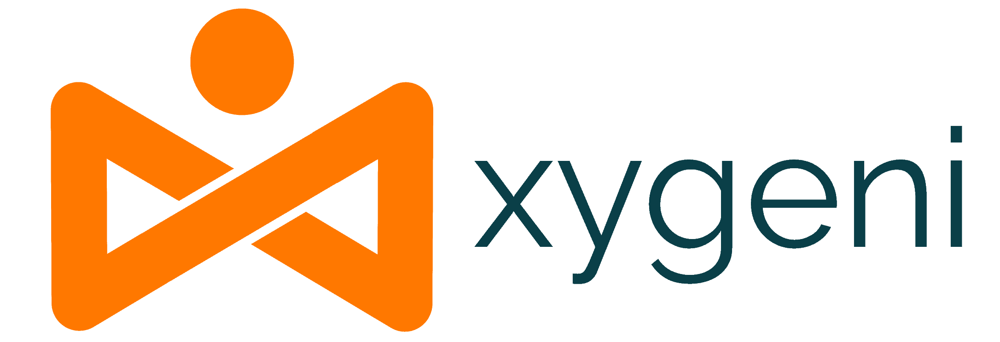
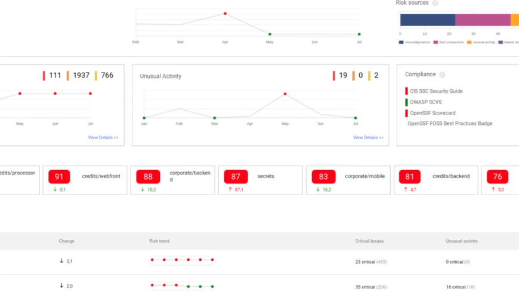
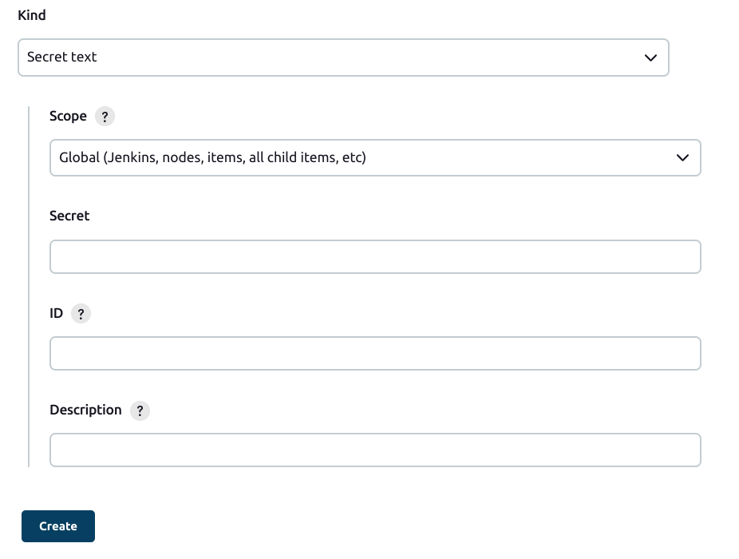
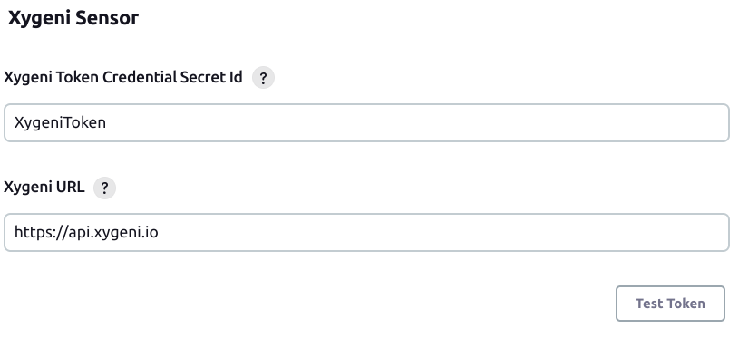
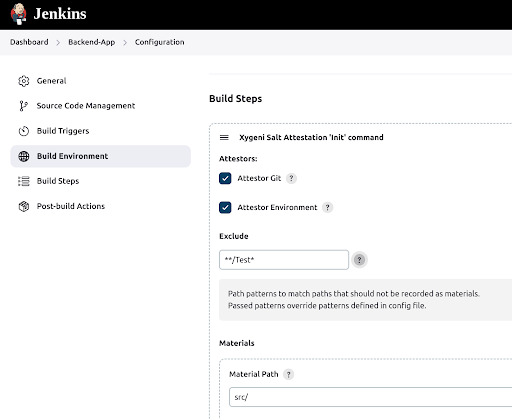
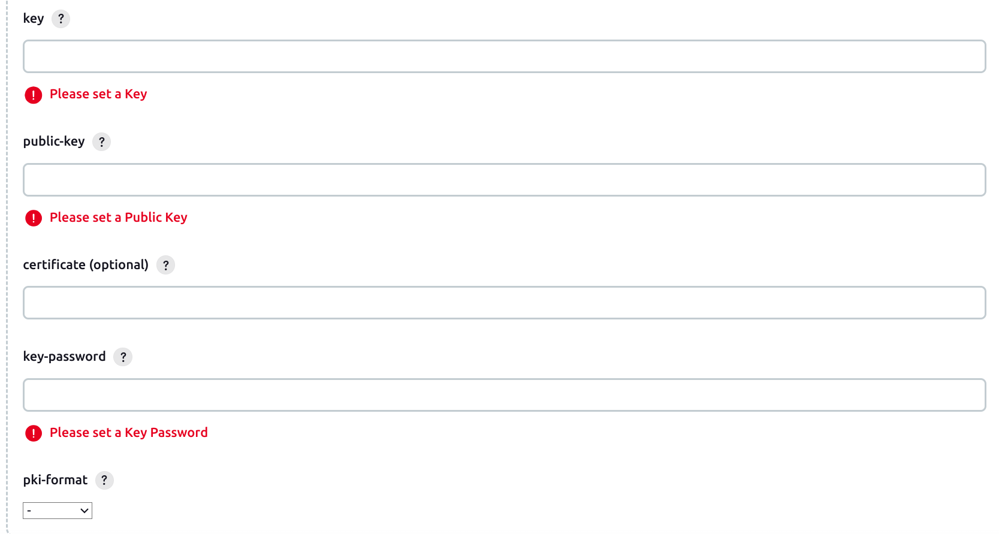
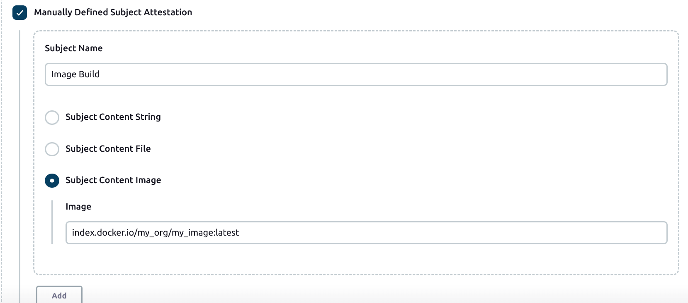

&emsp;&emsp; 

# Protect the integrity and security of your software assets, pipelines and infrastructure

[Xygeni](https://xygeni.io/?utm_source=jenkins&utm_medium=marketplace)  seamlessly evaluates the security posture of every asset of your Software Development Life Cycle (SDLC). It offers automated asset discovery and a comprehensive inventory, ensuring total transparency over your software projects. Cataloguing all artefacts, resources, and dependencies aids in making informed decisions for asset protection and implementing preventive and mitigative strategies.

Stay proactive with Xygeni's integrated anomaly detection. This feature safeguards your business operations by identifying unusual patterns that indicate emerging threats. Our code tampering prevention ensures the integrity of critical pipelines and files, and enforces security and build procedures. Additionally, Xygeni allows you to proactively identify risky or suspicious user actions, providing automated real-time alerts.


## Global and project security posture

Assess the security posture of all of the components in your SDLC effortlessly using the automatic inventory and assessment capabilities of Xygeni.




## Prevention and remediation

Systematically prevent and remediate risks everywhere in the Software Supply Chain, including open-source packages, pipelines, artefacts, runtime assets and infrastructure.


## Attack Detection
Integrating anomaly detection is a proactive measure to safeguard your business operations by identifying unusual patterns indicating emerging threats.


# Key features
Xygeni streamlines security processes, improves collaboration, and provides detailed reporting for effective software supply chain security management. It offers a range of essential features, including:

- **Identifying and tracking all components in software projects** to enhance security visibility and control.
- **Continuously scanning and assessing components and dependencies** for vulnerabilities and anomalies.
- **Prioritizing and supporting teams in efficiently remediating** software supply chain issues. Offering remediation support capabilities and **integration with ticketing tools**.
- Offering **advanced reporting capabilities** for tracking and monitoring changes and progress.


# Pre-Requisites
Please note that to utilize this plugin, a license of Xygeni Platform is required. You can easily request your license on our contact page. Dive in and experience the next level of efficiency!

# Contact us
Get in touch today! [Book a demo](https://xygeni.io/book-a-demo?utm_source=jenkins&utm_medium=marketplace) and let us know how we can help you.


Table of contents
=================

* [Installing the Xygeni-Sensor plugin](#installing-the-plugin)
  * [Set up credentials](#1-set-up-credentials)
  * [Configure plugin settings](#2-configure-xygeni-sensor-plugin-settings-)
* Xygeni pipeline-compatible Steps
  * [Xygeni Salt SLSA Attestation Provenance Step](#xygeni-salt-slsa-step)


# Installing the plugin

### Requirements:
- Java >= 11
- Jenkins >= 2.387.2

### 1. Set up credentials
- In Jenkins, navigate to `Manage Jenkins > Manage Credentials > System > Global Credentials > Add Credentials`
    * Select `Secret text` as Kind and fill out required information
  

### 2. Configure Xygeni Sensor plugin settings 
- In Jenkins, navigate to `Manage Jenkins > Configure System > Xygeni Sensor`,
    * Set the `Xygeni Token Credential ID` (generated above).
    * Set the `Xygeni API Url` (https://api.xygeni.io).
    * Optionally click the `TestToken` button to check url connection and token validity.
    * Click the `Save` button. 
    

# Xygeni pipeline-compatible Steps

The Xygeni Sensor plugin add some pipeline-compatible steps that helps using ``Software Attestations Layer for Trust (XygeniSalt)`` tool by Xygeni Security in the pipeline.

## Xygeni-Salt Custom Attestation
Creating and verifying software attestations is the core of the SALT framework. Attestations in SALT follow the in-toto Attestations Framework.
Get more info at Xygeni Docs: https://docs.xygeni.io/xydocs/build_security/salt_cli.html#_generate_custom_attestation (Subscription required).



### Init Step
Creates the initial draft with initial information

### Add Step
Adds elements (material, subject, product or statement) to the current draft attestation.

### Run Step
Runs a command and add an attestation predicate for the command execution.

### Commit Step
Builds the final attestation as in-toto Statement, serializes it as JSON, signs it with the passed key material, creates an in-toto Envelope with the statement as payload, the signature and the reference for the signing key, and publishes it in the attestation registry.

## Xygeni-Salt SLSA-Provenance Step

### Pipeline Step for building a SLSA Provenance attestation

Software attestations provide context (metadata) about artifacts like versions, origins (provenance) of the source code and its git repository plus branch / tag, the build process from which it was created, dependencies or security checks passed. The attestation is typically a signed document that gives software consumers a trusted context on the built artifacts. A common attestation format is SLSA provenance.

The Xygeni Sensor plugin add a Post Build Step to generate [SLSA provenance attestations](https://slsa.dev/provenance/).
This step command will generate an slsa attestation provenance ``xygeni-salt-attestation.json`` in SLSA format and upload attestation to ``salt.xygeni.io`` server.

### Job configuration - Pipeline project

**Pipeline Syntax tool** could helps to define ``xygeniSalt`` steps with their arguments. 

 * The ``xygeniSaltSlsa`` step could be invoked for generating SALT provenance. Build information for the registered attestation **subjects** (also known as software 'products' or 'artifacts') will be registered in the signed attestation.

### Step parameters

#### Subjects 

Subjects could be provided explicitly as a list in the ``subjects`` property. Each item in the list is a map with a given ``name`` and a content, either a Docker image published in a remote registry as part of the build (``image: 'REGISTRY/IMAGE_NAME:TAG'``), a local file produced by the build as a packaged artifact (``file: 'path/to/file.zip'``), or a value (which could be a SHA digest of a given artifact, a base-64 encoded binary value, or a string representing the artifact (``value: 'sha:03afb3...1c24'``).

Alternatively, subjects could be referenced by pattern using the ``artifactFilter`` pattern (an Ant-like pattern), which matches files in the workspace that will be used as subjects for the SLSA provenance attestation.

#### Signer configuration

The ``key`` / ``publicKey`` parameters contain the key pair to use for signing the provenance file. The signature is done with the private key, and the public key is added to the signed attestation for verification by software consumers. The keys are provided as either PEM-encoded values (text format with key enclosed between ``-----BEGIN...-----`` and ``-----END ...-----`` delimiters). The PEM-encoded key could be provided also as a path to the key file relative to the workspace directory (prefix the path with ``file:`` prefix), or as an environment variable prefixed with ``env:``.

An optional X.509 certificate could be used for helping the software consumer to trust the signature, using the ``certificate`` parameter with a similar format.

The ``pkiFormat`` specifies the signature format (one of ``x509``, ``minisign``, ``ssh``, ``pkcs7`` or ``tuf``). Use ``x509`` as a good default.

Remember to encrypt the signing private ``key`` with a strong password !
For the ``key-password``, create a Jenkins secret and use the secret name as value for the field.

You can use ``xygeniSalt keygen`` command option to generate and save signing keys to use in this attestation command.



#### Keyless signatures

To use keyless signing, the `--keyless` option could be passed to the attestation commit | provenance commands. This will fetch an OpenID Connect (OIDC) from specific issuers, using an OAuth flow (standard or device).

Check the Xygeni docs for complete info: https://docs.xygeni.io/xydocs/build_security/salt_how_to.html#_use_keyless_signatures (subscription required)


#### Adding XygeniSalt-SLSA attestation provenance step to a Pipeline

```
post {
    success {
       
        archiveArtifacts: 'target/*.jar, ouput/report*.html'
    
        withCredentials([string(credentialsId: 'slsa-key-pass', variable: 'KEY_PASS')]) {
            xygeniSaltSlsa( 
              artifactFilter: 'target/*.jar', 
              subjects: [[
                name:'build image', 
                image:'index.docker.io/my_org/my_image:latest']], 
              key:'my.key', 
              publicKey:'mypub.pem', 
              keyPassword:'$KEY_PASS', 
              pkiFormat: 'x509'        
            )
        }
    }
}
```


#### Adding XygeniSalt-Custom attestation steps to a Pipeline

```
pipeline {
    agent any

    stages {
        stage("Init") {
            steps {
               xygeniSaltAtInit()
            }
        }
        stage('Add') {
            steps {
               xygeniSaltAtAdd(
                 items: [[name: 'name', value: 'value']])
            }
        }
        stage('Run') {
            steps {
               xygeniSaltAtRun(
                 command: 'dir', 
                 items: [[name: 'name', value: 'value']],
                 maxerr: 100, 
                 maxout: 100, 
                 step: 'mystep', 
                 timeout: 10)
            }
        }
    }
    post {
        success {
            withCredentials(
              [string(credentialsId: 'OIDC_TOKEN', 
              variable: 'SIGSTORE_ID_TOKEN')]
            ) {
                xygeniSaltAtCommit(
                  certs:[keyless:true],  
                  outputOptions: [output: 'out.json', outputUnsigned: '-', prettyPrint: true])
            }
        }
    }
}

```

### Job configuration - Freestyle project

The plugin provides a ```Post-build action``` which will generate SLSA provenace attestations.

**Artifact Path Filter**: Specifies the artifacts to include.


**Manually defined Subject Attestation**: Specifies one or more name and content to include (a string, file or image).



